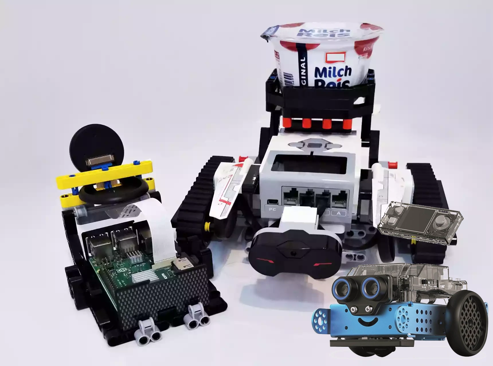
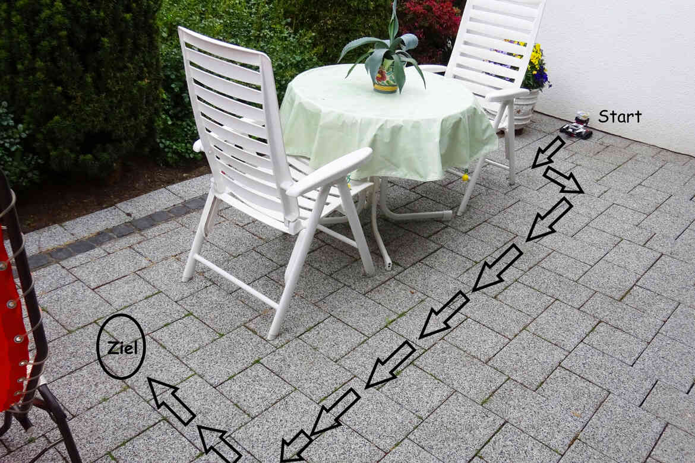
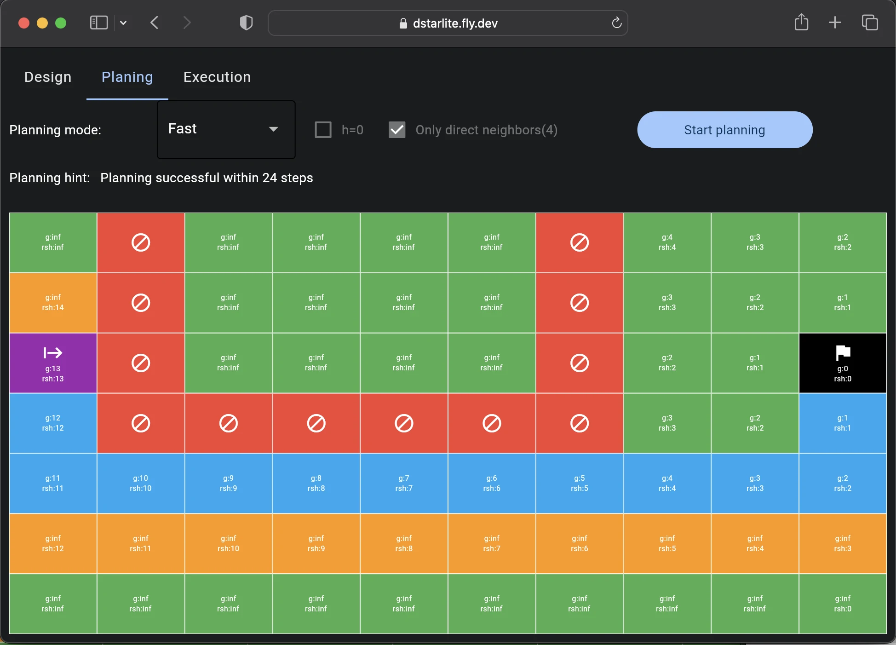

# Routeplanning for robots


Autonomous robots move through industrial halls on Earth and on the surface of distant planets without human intervention. A path planning algorithm calculates the shortest route to the desired destination. 

- Original project: [Make Magazin 2021/1, Page 78.](make-magazin.de/xb4a) 

- Article: [Pfadplanung für Roboter](https://www.heise.de/select/make/2021/1/2031114325889691579)

- Code Repo: [robodhhb/Interactive-D-Star-Lite](https://github.com/robodhhb/Interactive-D-Star-Lite)

In this project, I'll use toy robot of my daugther,[Botley 2.0](https://amzn.eu/d/19yy9Va),a programing robot with 2.4 GHz remote controller. It has obstable-detection, but doesn't have bluetooth programming interface. I plan to use ESP32 boards to upgrade it so that it could be pragram with python/micropython.

# Steps: 
- [ ] Analyze Botley 2.0 controller & sensors
- [x] Confirm Materials & Tools. Buy ESP32 boards, additions sensors, battery
- [ ] Modify the hardwares and Test: try to control the motor with eps32 board, read motor speed & obstable signal.
- [ ] Adjust the routeplaning program for the new robot.
- [ ] Try [Snap4Arduino](https://snap4arduino.rocks/)

# Progress
- week 41 (12.10.2022 - 18.10.2022): Find interesting project
    1. TonUINO
    2. Solar electricity for microcontroller
    3. ESP data transmission
    4. Walkie-talkie
    5. *Routeplanning for robots*❤️

- week 42 (19.10.2022 - 25.10.2022): Shop boards/sensors/tools, Check Repo Code/Simulation (Done, on Mac), found some tools/repo may help.

    1. [EV3 Brick Magic tool](https://afarago.github.io/EV3TreeVisualizerPages/) by Attila Farag, was created for connecting the EV3 Brick with the magical unicorns over USB or Bluetooth connection over the standard LEGO firmware. It contains an [online version on Azure](https://ev3treevis.azurewebsites.net) to visualize the old Ev3 Lab project. For Mindstorms App 51515, SPIKE Prime and Essentials and EV3Classroom, you could try his [Lego App Tools on Azure](https://legoapptools.azurewebsites.net/). There's blog described how he hacks the app logic: [Experiments with the SPIKE App Debug Mode](https://digitalbrick.home.blog/2021/09/20/experiments-with-the-spike-advanced-mode-debug-mode/)
    1. [Ev3dev](https://www.ev3dev.org), is a Debian Linux-based operating system that runs on several LEGO® MINDSTORMS compatible platforms including the LEGO® MINDSTORMS EV3 and Raspberry Pi-powered BrickPi. Ev3dev supports many popular scripting languages out-of-the-box, so you can get started right away with your favorite language and libraries.
    1. [ESP-32 based LEGO SPIKE simulator in Micropython environment](https://github.com/rundhall/ESP-LEGO-SPIKE-Simulator), with [YouTube video](https://youtu.be/OVu2Ycx_PgU)
    1. [miro-ROS](https://micro.ros.org), puts ROS 2 onto microcontrollers.

- week 43 (26.10.2022 - 01.11.2022): Check the robot programming
    1. Disassemble Botley robot

        
    
        main board

        

        The two motor could be controlled by the
        [TRA9118A Motor Driver](http://www.chipsourcetek.com/DataSheet/TRA9118A.pdf)

        | F00 | F01 | F02 | F03 | Mode |
        |:---:|:---:|:---:|:---:| :---  |
        |  L  |  L  |  L  |  L  | still |
        |  L  |  H  |  L  |  H  | forward |
        |  H  |  L  |  H  |  L  | backward  |
        |  L  |  H  |  H  |  L  | turn left |
        |  H  |  L  |  L  |  H  | turn right |

    
        sensor board for Motor Encoder & obstacle detection

        

    
    
        Motor with Counter Grating

        

    1. Test [ESP-C3-32S/M5Stamp-C3](https://www.waveshare.com/wiki/ESP-C3-32S-Kit) Boards: flash MicroPython, run example code.

- week 43 (02.11.2022 - 08.11.2022):
    1. quick overview the basics of python/micropython
    1. try rust for esp-c3

- week 44 (09.11.2022 - 15.11.2022):
    1. solder the F00,F01,F02,F03 to control the moter

        

    1. program to test the movement: move forward/back, turn left/right
    1. remember to connect GND with the board

- week 45 (16.11.2022 - 22.11.2022):
    1. try to figure out the obstacle detection function.
    1. look into [mBot2](https://education.makeblock.com/mbot2/) from Makeblock for the project, which contains an esp32 controller and could program in micropython directly, as Botley maybe a bit tricky to get it working with obstable detection. Then I will focus on the communication between robot and pc first.

        


## Brief information
- Understand and apply interactive path planning
- Raspberry Pi/Mac/phone controls robots via Bluetooth
- Programming with Python
- Operating the path planning simulator

## Checklist
- Time required: 4 hours
- Costs: 10 Euro (without robots)
- Programming: Python on Linux, Windows or Mac

## Material
- Raspberry Pi from model 3B+ or higher (without camera)
- MicroSD memory card with Raspbian Buster or Raspberry Pi OS Buster installed (both Python 3.7.3)
- Lego EV3 kit 31313 or Botley 2.0 or any robots


## Path planning translated from MakeMagazine
Path planning algorithms are among the oldest algorithms of artificial intelligence. Most people know them from the navigation in the car or from the route planner on Google Maps. As early as 1959, the Dutch mathematician Edgar W. Dijkstra described an algorithm for path planning that can be used to calculate the shortest distance between two points in advance. In principle, you have places (nodes) through which you can drive, which are connected by edges (roads). The edges are assigned costs (length of the road). The braid from the edges connected by edges is also called graph.

Based on the number of nodes, their connections via edges and the edge weights, the Dijkstra algorithm can iteratively determine the shortest path by program from a given starting node to a target node. However, he goes through all knots and edges relatively stubbornly.

Further developments such as A* (read A-Star) also use an initial estimate for the start of which edges of nodes could lead faster to the goal. Such estimates are also called heuristics and can be found in many areas of computer technology. For path planning algorithms, for example, a simple heuristic is the assumption of a crow flies as the first estimate for distance. A* therefore plans faster than Dijkstra's algorithm in many cases.

However, A* has a weakness: If the robot encounters a previously unknown obstacle, i.e. an interruption of an edge, a complete rescheduling is carried out from the current location to the target. The D* algorithm (read D-Star), on the other hand, continues to use parts of the previous planning and is therefore faster. Such algorithms are called incremental planning algorithms.

A frequently used further development of D* is our algorithm D*Lite used here. It is also an incremental, heuristic search algorithm, but it works even more efficiently and is still easier to implement.

D*Lite, like A* and D*, is one of the so-called grid-based methods. The robot's mission area is divided into a matrix of square fields of the same size. On the previous page at the bottom right (screenshot) you will see our mission area terrace with a finished plan. Each tile represents virtually a node that is connected to other nodes via edges. The edges to the nodes at the top, bottom, left and right all have the same costs, which simplifies implementation.


Path planning: The terrace is divided into tiles.

Table and chairs are the obstacles to be bypassed.

## Mission

Our mission area (the terrace) is 10 fields wide and 7 fields high. Each individual field is 40cm × 40cm in size. The field size is based on the size of the robot plus a margin around the robot. The size of the mission area depends on the specific task. The operator, i.e. you, determines the size itself.

Some of the fields play a special role: Exactly one field is the starting field (green), and exactly another field is the target field (red). The operator determines in the program which they are. In addition, the operator can mark fields as known obstacles (brown). The robot is not allowed to drive through this, as there is a risk of collision there. He has to drive around her. In the example, this is the area where the chairs and the table are on the terrace.

Path planning now has the task of planning the shortest possible path between the start and finish field, bypassing the known obstacles. On the previous page, the planned path is marked in blue color between the start and destination field. The algorithm has earmarked the yellow fields for a possible rescheduling, but has not been treated definitively, as the shortest path runs in a different direction, as you will see later.
## Neighboring fields

    

## System structure

    

## Interactive D*Lite

## Bluetooth interface

## Programming

    


1. Launch the Simulator

    ```
        git clone https://github.com/robodhhb/Interactive-D-Star-Lite.git
        cd Interactive-D-Star-Lite\20_Raspberry_Pi_project
        conda create -n ssrdp python=3.10
        conda activate ssrdp
        python DStarLiteMain.py
    ```
1. In `Design` tab, Change the grid width & height, press `Generate Grid`, change `Click mode` to put Start/Goal point or set Obstales by clicking the map zone.
1. In `Planing` tab, change `Planning mode` Fast/Slow/Manual, click `Start Planning` to get a routine. `only direct neighbors` means only move up/down/left/right, otherwise the robot could move diagonally.
1. In `Execution` tab, change `Robot start orientation` to match the robot, click `Execution plan` to see the simulation or send commands to robot.

## Robot programming
    1. Overview

        

    2. Main Logic - Text

        

## Installation and test

## Expansion possibilities


# Referrences
- [Grid and Graph based Path Planning Methods](https://cw.fel.cvut.cz/old/_media/courses/b4m36uir/lectures/b4m36uir-lec04-handout.pdf)
- [LEGO Robotics](https://github.com/LEGO-Robotics/LEGO-Robotics)
- [Snap4Arduino](https://github.com/bromagosa/Snap4Arduino)
- More on the subject, Detlef Heinze, [Pi controls Lego EV3, Make special issue Robotics 2019](https://www.heise.de/select/make/2019/7/1573929070378454)
